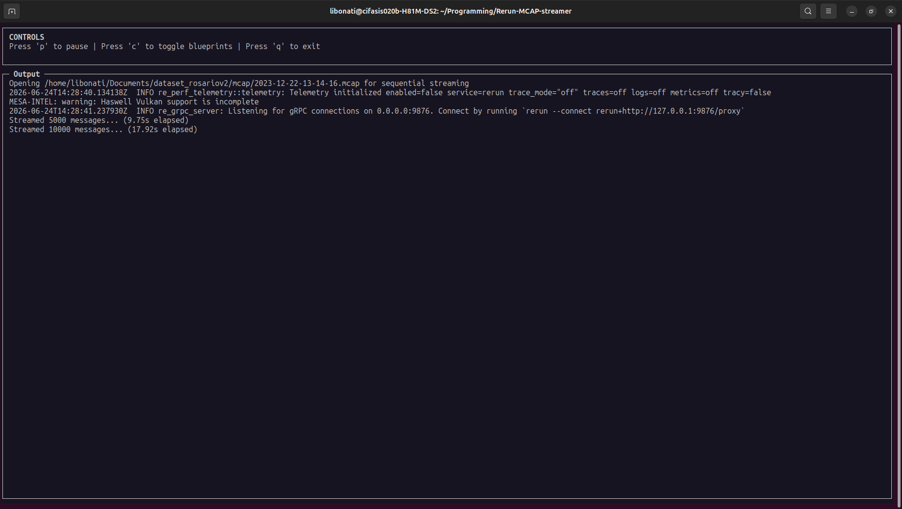
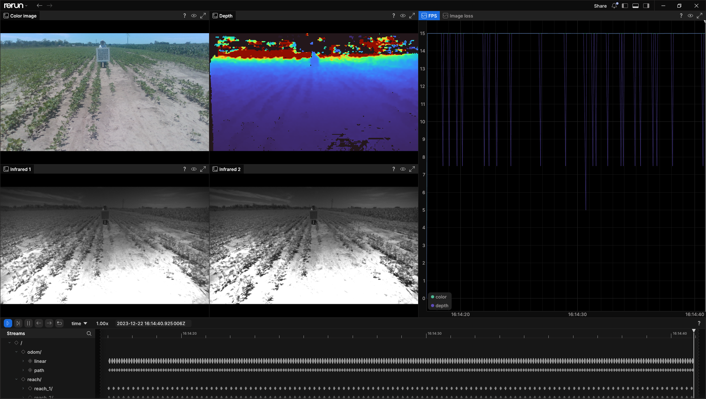
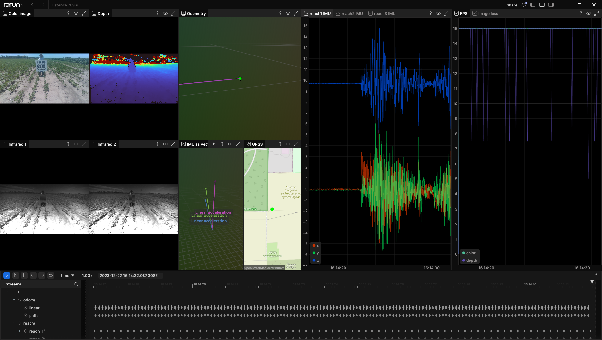
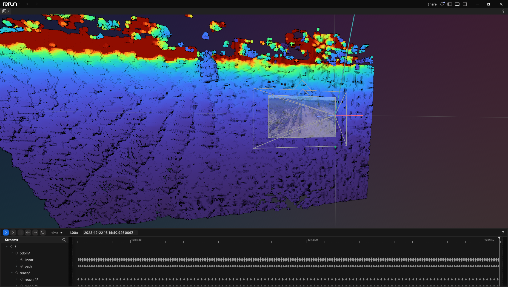

# Rerun MCAP streamer

This script makes it possible to work with MCAP files 'Bigger than RAM' in Rerun by reading them sequentially and 
logging the data as it comes.

It was made to be used with the [Rosario Dataset V2](https://cifasis.github.io/rosariov2/), which has recordings with a file size of +90GB,
but we're working on making it useful for any recording.

## Usage

Before using the script, ensure that all dependencies are installed by running `pip install -r requirements.txt` 
(preferably inside a virtual environment). For example

```bash
# install the virtual environment manager
sudo apt install python3-venv
# create virtual environment
python3 -m venv venv
# whenever you want to use it, source the activation file
source venv/bin/activate
# install the requirements
pip install -r requirements.txt
```

Then use the script by running

```bash
python3 rerun_batch.py [-h] -b BAG_PATH [-m MEMORY_LIMIT] [--header_timestamp]
                                        [--urdf URDF] [--blueprints BLUEPRINTS]
```

Once it starts it displays the controls, which allow to quit, pause, and change the current blueprint.

## Example

We will use the Rosario Dataset V2 to showcase the streamer. If you want to follow along you should read the documentation for 
setting everything up in <https://github.com/CIFASIS/rosariov2> (Particularly, the ROS1 to ROS2 Conversion docs)
The environment variable `$ROSARIOV2` is set to the directory with the dataset. We also need the urdf from the repository.

Then, we run `python3 rerun_batch.py -b $ROSARIOV2/mcap/2023-12-22-13-14-16.mcap --header_timestamp --urdf ./data/rosario_v2.urdf.xacro`.
This will start the controller in the terminal, made with curses, to handle the streamer interactively.



And start a Rerun server in the background



Then, by pressing 'toggle blueprints' we can change between views.



## Blueprints

Rerun has a filetype to save how the viewer is currently setup, which they call a 'Blueprint'.
These blueprints allow to see the information in different ways, depending which container type is used.

We can quickly change between blueprints by logging the files saved in the './blueprints' directory (or the one set in the --blueprints option).



